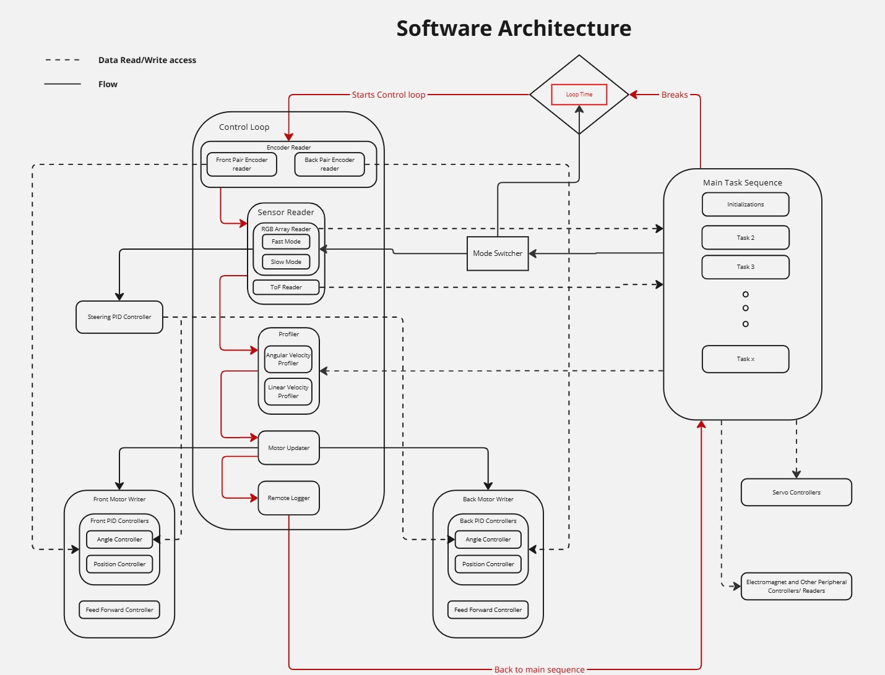
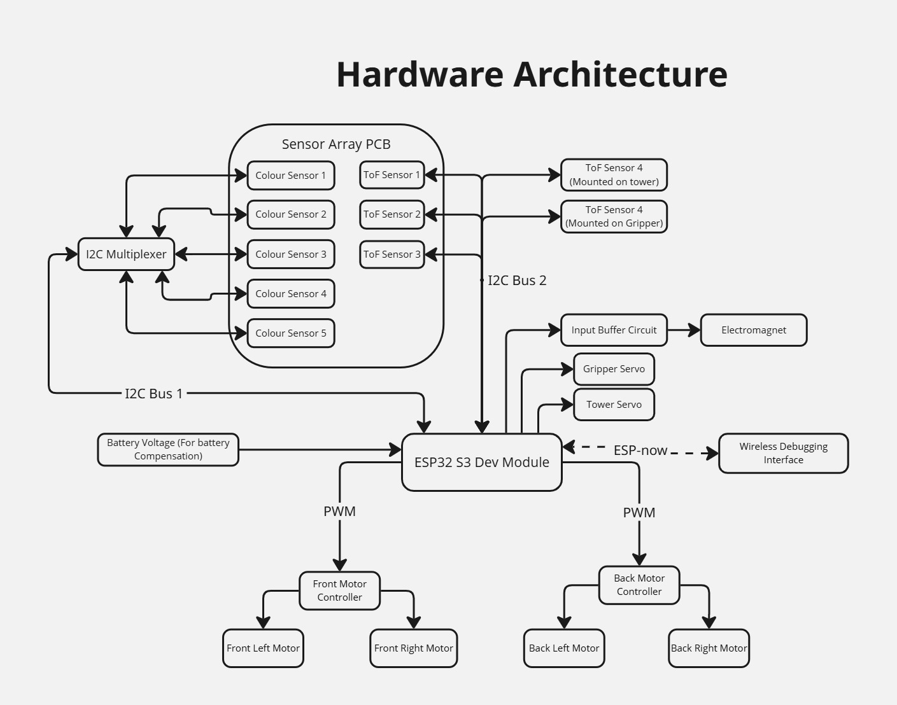
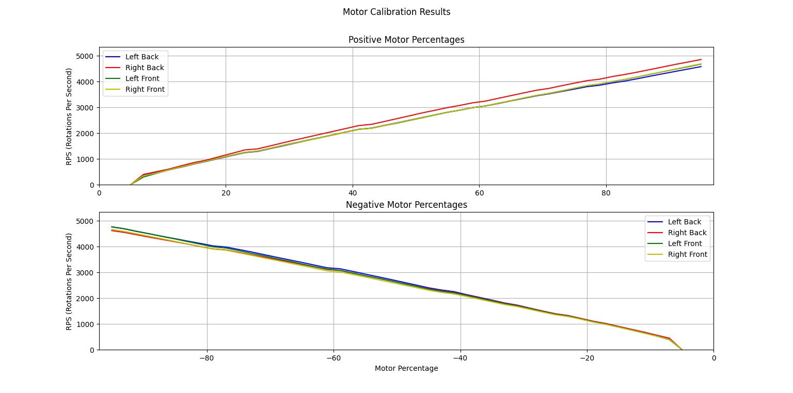
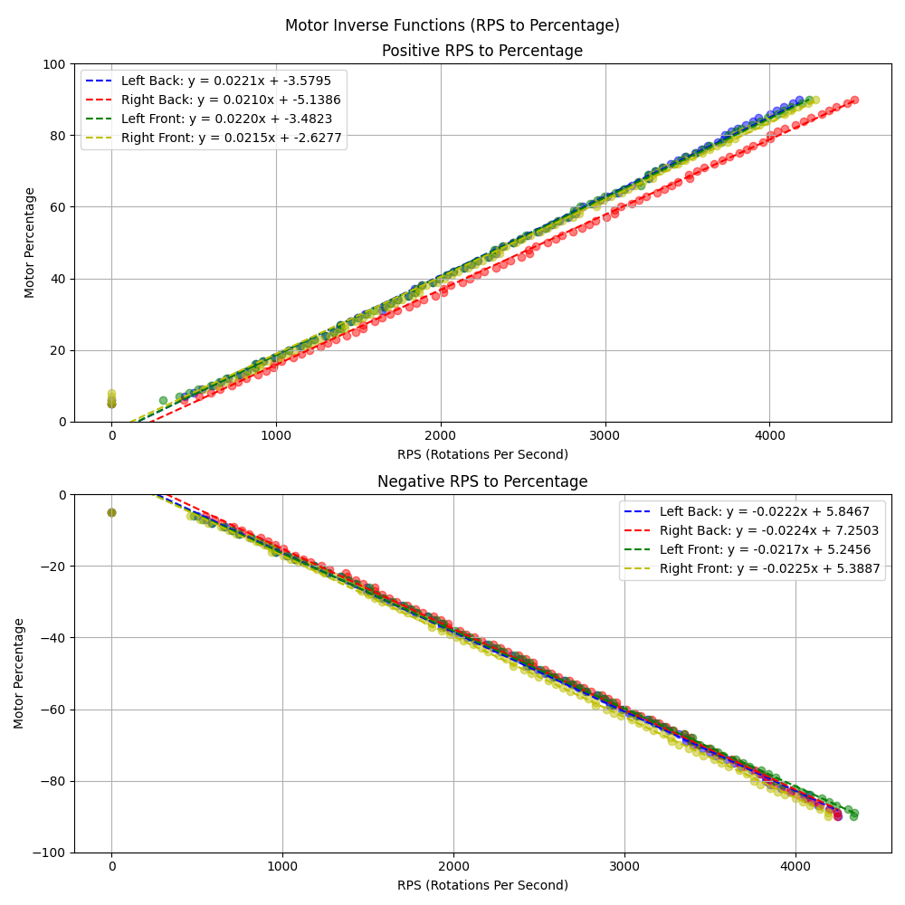
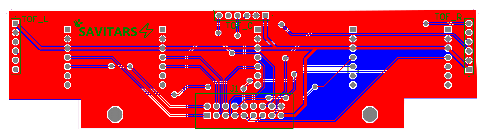
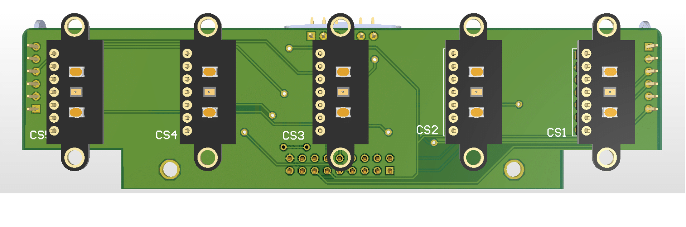
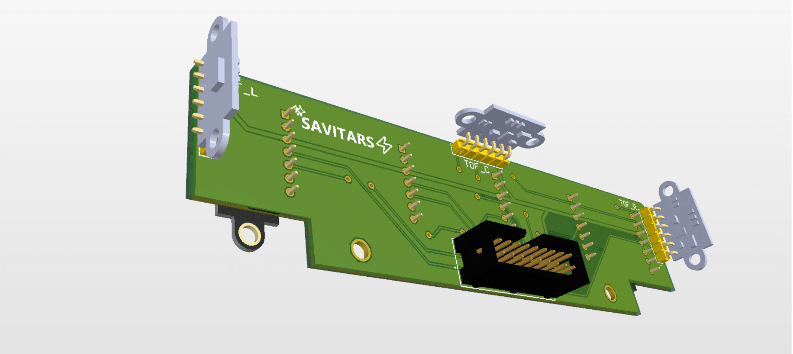

# Savitar Bot
## Compilations of Videos we had taken
[Youtube](https://youtu.be/TuMXFdOwjP4)

## Codebase
[Savitar Robot Codebase](https://github.com/KiranGunathilaka/savitar_robot_codebase)

## Robot Architeture

## Motor Responses
These were done to get the motor function between rps and pwm percentage that need to be fed for feed forward control.

All the motor logs are available here. 
[Codebase/Test](https://github.com/KiranGunathilaka/savitar_robot_codebase/tree/main/test/motor_logs)

## PCB

## CAD Designs
### Design V3
Tested and final printed design
.png)
.png)
.png)

## Previous Designs
### Design V1
.png)
.png)
### Design V2
.png)
.png)
.png)

